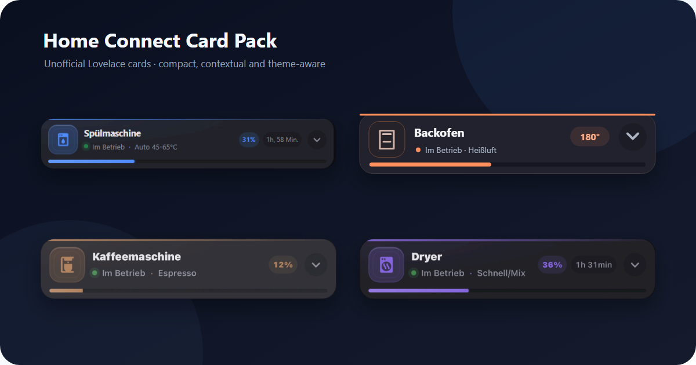
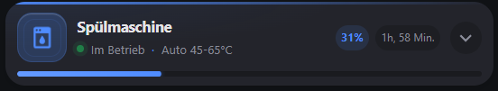
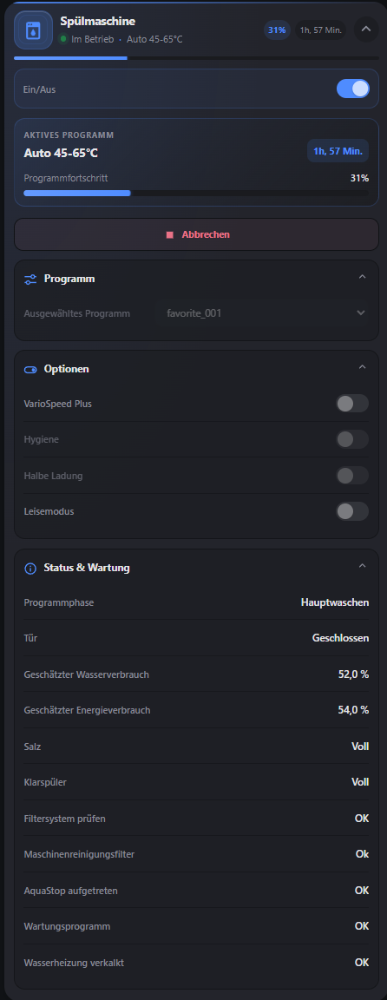
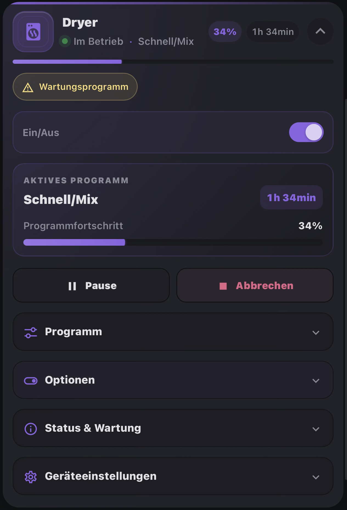

# Home Connect Card Pack

[](https://github.com/leMax6608/home-connect-card-pack/actions/workflows/validate.yml)
[](LICENSE)



An **independent, unofficial** family of four native, dependency-light Lovelace custom cards for Home Assistant:

- Bosch/Siemens Home Connect dishwasher
- Home Connect oven
- Home Connect coffee machine
- Home Connect dryer

The cards are built with TypeScript and Lit. They do **not** depend on `button-card`, Mushroom, or another custom card. All commands use Home Assistant services; entity state is never mutated directly.

## Recommended Home Assistant integration

This card pack is primarily recommended for use with [Home Connect Local](https://github.com/chris-mc1/homeconnect_local_hass), which communicates with supported appliances over the local network. The standard Home Connect integration may also work, but available entities and entity names can differ. All mappings remain manually configurable in the visual editor.

## Screenshots

The preview above gives an overview of the card pack. Each appliance has a prepared two-image showcase: the compact card is always visible, while the complete card can be opened on demand. This keeps the README easy to scan without hiding the detailed view.

### Dishwasher



<details>
<summary>Show expanded dishwasher card</summary>
<br>



</details>
-->

<!--
### Oven


<details>
<summary>Show expanded oven card</summary>
<br>


</details>
-->

<!--
### Coffee machine


<details>
<summary>Show expanded coffee-machine card</summary>
<br>


</details>
-->

<!--
### Dryer


<details>
<summary>Show expanded dryer card</summary>
<br>



</details>
-->

## Highlights

- Compact summary with operating state, program, progress bar, remaining time and warnings
- Smooth, CSS-only expand/collapse and progress transitions
- Context-aware controls for off, idle, running and paused states
- Two-tap confirmation for Cancel prevents accidental program termination
- Program selects, number sliders, switches/lights, action buttons and grouped status
- Fully manual display names for technical program values, used consistently across selector and status displays
- Four full visual editors using Home Assistant entity pickers
- Device-registry-first entity discovery; manual assignments always win
- One-click YAML export and a privacy-conscious entity discovery report in every editor
- Click the appliance identity for Home Assistant's More Info dialog; use the metrics/chevron to expand the card
- Click any read-only status row to open its native Home Assistant More Info dialog
- Optional custom accent colors while retaining safe appliance-specific defaults
- Sections-dashboard sizing hints and appliance-aware card suggestions on supported Home Assistant versions
- Optional entities leave no placeholders or layout gaps
- Safe handling of missing, `unknown` and `unavailable` entities
- Relevant-entity `shouldUpdate()` filtering for busy Home Assistant dashboards
- Responsive light/dark/theme-aware UI
- English and German UI labels selected from the Home Assistant language
- One small bundled module for all four cards

## Installation

### HACS custom repository

1. Push this repository to GitHub and create a release containing `dist/home-connect-card-pack.js`.
2. In HACS, open **Frontend**, choose **Custom repositories**, add the repository URL and select **Dashboard**.
3. Install **Home Connect Card Pack** and reload the browser.

HACS normally adds the Lovelace resource. If needed, add it manually:

```yaml
url: /hacsfiles/home-connect-card-pack/home-connect-card-pack.js
type: module
```

### Manual

1. Run `npm ci && npm run build`.
2. Copy `dist/home-connect-card-pack.js` to `/config/www/home-connect-card-pack.js`.
3. Add this dashboard resource and reload the browser:

```yaml
url: /local/home-connect-card-pack.js
type: module
```

## Configure in the visual editor

Add a card and search for **Home Connect**. Every card exposes a grouped editor.

1. Under **General**, choose any entity belonging to the appliance as **Device anchor entity**.
2. Discovery starts automatically; **Detect device entities** can run it again after manual changes.
3. Review the proposed mappings and replace any duplicate/alternative entity with your preferred one.
4. Under **Program**, open **Rename programs manually** to assign optional display names to the available program values.
5. Configure only the functions you want. Unconfigured fields are not rendered.

Program names are never generated or guessed. The editor shows the original Home Assistant value next to an empty name field. A custom name changes only what the card displays; selections and service calls always retain the exact original option value.

The two utility buttons below discovery copy either a paste-ready YAML configuration or an entity discovery report. The report is intended for troubleshooting mapping issues and deliberately excludes entity states, attributes, device-registry IDs, IP addresses and credentials. Entity IDs and display names can still contain personal labels, so review it before posting it publicly.

If a card is created from YAML with only an `entity` anchor, opening its visual editor now starts discovery automatically. On Home Assistant 2026.6 and newer, matching dishwasher, oven, coffee-machine and dryer entities can also suggest the appropriate card directly in the entity-based card picker. Older Home Assistant versions simply ignore this optional picker capability.

Discovery reads `config/entity_registry/list`, finds the anchor's `device_id`, considers only enabled entities on that same device, and scores their registry names, entity IDs, domains and selected state attributes against role-specific aliases. The anchor itself may also fill the matching role—for example, an oven status anchor becomes `status_entity`. Discovery only fills empty fields and never overwrites a manual choice. If the anchor has no device registry link, the editor explains that discovery is unavailable and remains fully usable manually.

## Minimal YAML

```yaml
type: custom:home-connect-dishwasher-card
name: Bosch Dishwasher
power_entity: switch.bosch_dishwasher_power
operating_state_entity: sensor.bosch_dishwasher_operation_state
active_program_entity: sensor.bosch_dishwasher_active_program
progress_entity: sensor.bosch_dishwasher_program_progress
remaining_time_entity: sensor.bosch_dishwasher_remaining_program_time
filter_check_entity: binary_sensor.bosch_dishwasher_filtersystem_prufen
aquastop_entity: binary_sensor.bosch_dishwasher_aquastop_aufgetreten
```

Complete examples matching the reference entities are in [`examples.yaml`](examples.yaml).

## Shared options

| Key | Purpose | Default |
| --- | --- | --- |
| `entity` | Anchor used only for registry discovery | — |
| `name` / `icon` | Override the card identity | Device-specific |
| `accent_color` | CSS color or theme variable used as the card accent | Device-specific |
| `power_entity` | Power switch or select | — |
| `status_entity` | General status | — |
| `operating_state_entity` | Primary state used for context | — |
| `active_program_entity` | Program currently running | — |
| `selected_program_entity` | Program selection | — |
| `program_names` | Original program values mapped to manual display names | — |
| `progress_entity` | Numeric program progress | — |
| `remaining_time_entity` | Remaining time | — |
| `start_entity` / `pause_entity` / `resume_entity` / `cancel_entity` | Button entities | — |
| `default_expanded` | Open card initially | `false` |
| `animations` | Enable card animations | `true` |
| `confirm_cancel` | Require a second click within five seconds before Cancel | `true` |
| `show_progress` / `show_remaining_time` | Summary/detail visibility | `true` |
| `show_status_section` / `show_options_section` / `show_settings_section` | Section visibility | `true` |

Device-specific keys are presented by each card's visual editor and demonstrated in `examples.yaml`.

## State-dependent behavior

- **Off:** identity, status, warnings and the power control; program controls remain hidden.
- **Idle:** program setup and Start are prominent.
- **Running:** progress, Pause and Cancel are prominent; program-changing controls are disabled.
- **Paused:** Resume and Cancel are prominent; program-changing controls remain disabled.
- **Warning:** configured warning entities appear as warm, non-aggressive chips.

Cancel is guarded by default: the first click changes the button to **Confirm cancel**, and only a second click within five seconds sends the command. Set `confirm_cancel: false` if you explicitly prefer one-click cancellation.

The state classifier recognizes common Home Connect/HA running, paused, off and idle terms. Unknown integrations safely fall back to idle behavior instead of breaking the card.

## Services

The pack dispatches only standard services based on the configured entity domain:

- `switch.turn_on` / `switch.turn_off`
- `light.turn_on` / `light.turn_off`
- `button.press`
- `select.select_option`
- `number.set_value`

Each entity has an in-flight lock to prevent double submits. A failed service call is shown inside the card without blocking the rest of the dashboard.

## Development

```bash
npm ci
npm run typecheck
npm test
npm run build
```

The release file is `dist/home-connect-card-pack.js`. Keep this file in GitHub releases (or commit `dist/` for a direct-source HACS workflow). See [`ARCHITECTURE.md`](ARCHITECTURE.md) for design decisions.

## Browser and Home Assistant support

The bundle targets modern browsers supported by contemporary Home Assistant and declares Home Assistant `2024.8.0` as its HACS minimum. It uses CSS `color-mix()` with Home Assistant theme variables for subtle surfaces. Sections-view sizing is used when supported; entity-based card suggestions require Home Assistant 2026.6 or newer. Both enhancements degrade safely on older supported versions.

## License

The source code is available under the [MIT License](LICENSE).

## Trademark notice

Home Connect Card Pack is an independent, unofficial open-source project. It is not affiliated with, endorsed by, sponsored by, or otherwise officially connected to Home Connect GmbH, BSH Hausgeräte GmbH, Bosch, Siemens, Home Assistant, or their affiliates.

“Home Connect”, “Bosch”, “Siemens”, “Home Assistant”, and associated marks are trademarks of their respective owners. Names are used only to describe compatibility. No company logos or official brand artwork are included. The MIT License applies to this project's source code and does not grant rights to any third-party trademarks.

<p><sub>Disclosure: This project and parts of its documentation were created with the assistance of generative AI, then reviewed and tested.</sub></p>
